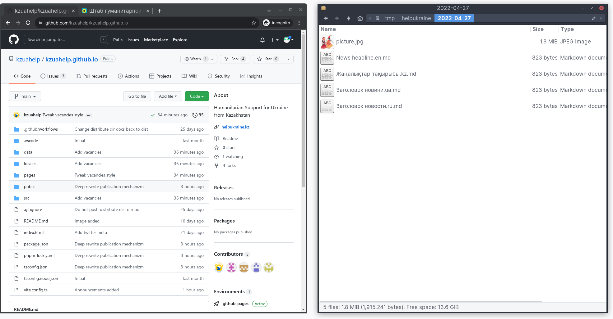
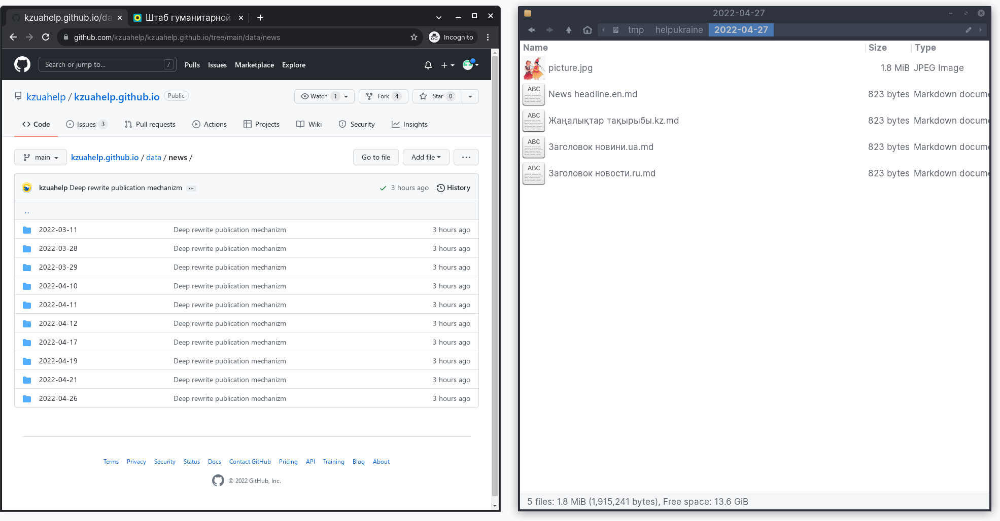
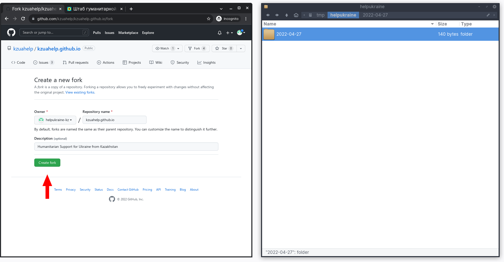
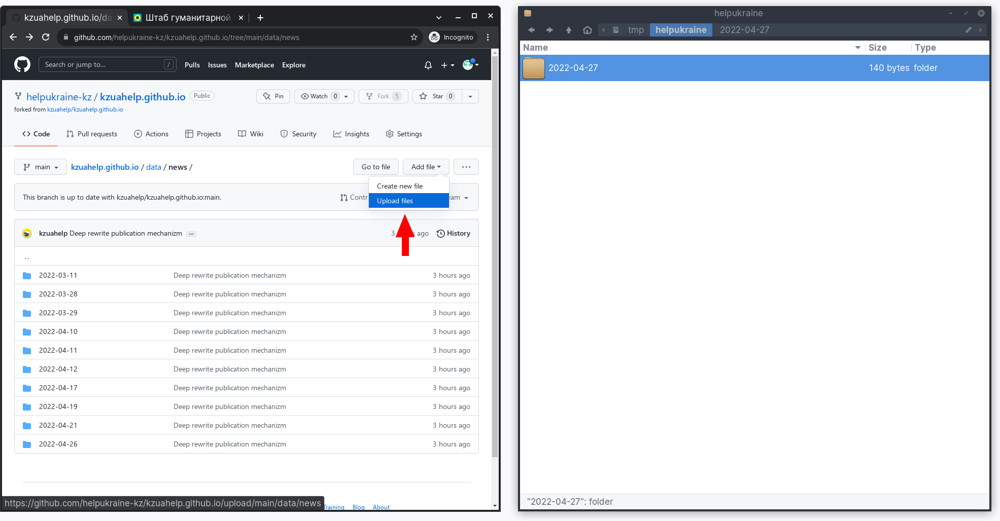
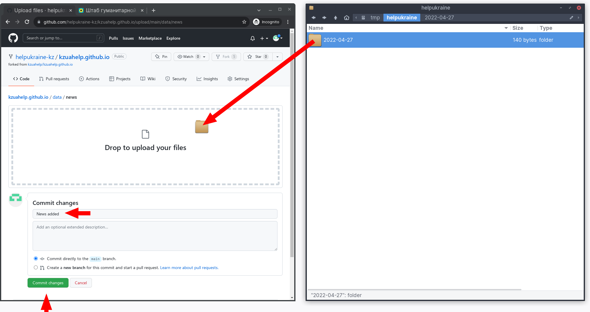
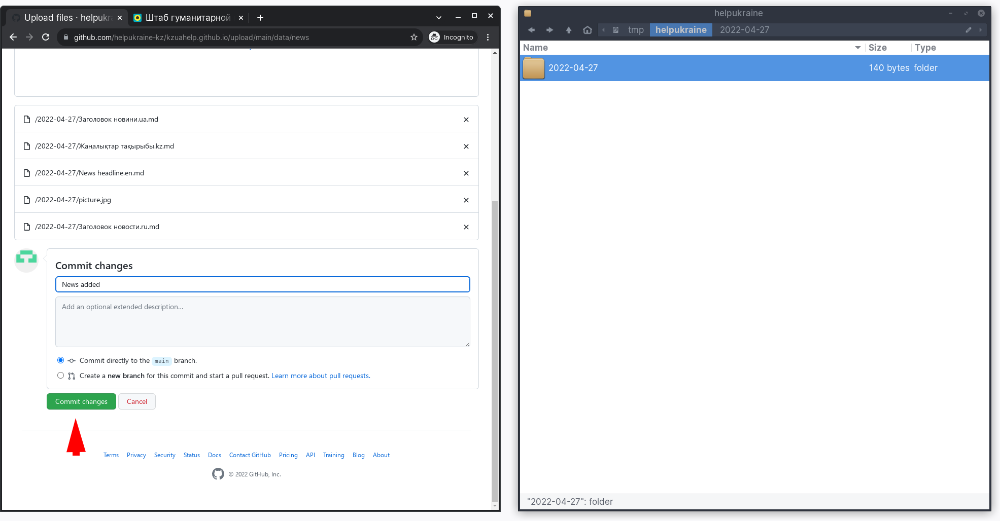
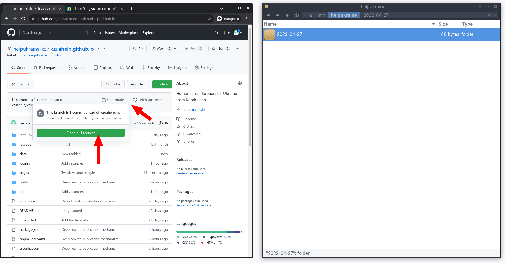
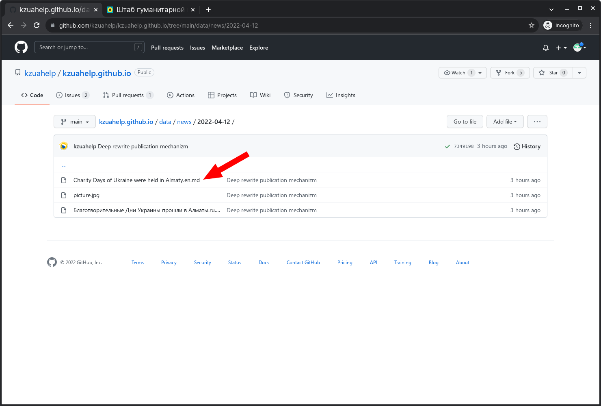
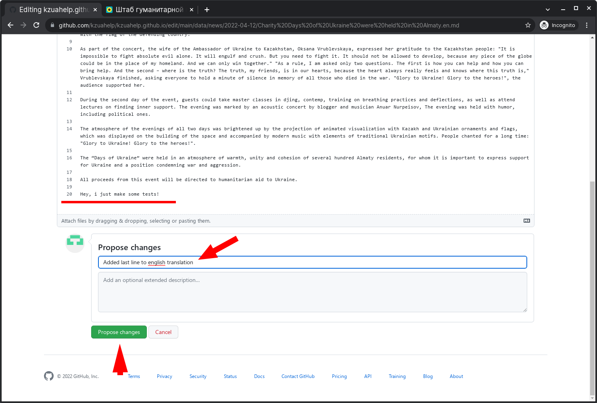

# Как добавлять и редактировать новости на сайте

Это очень подробная инструкция по коллективной работе с сайтом при помощи GitHub. Не пугайтесь объёма статьи, на самом деле вы поймёте насколько всё просто после первой публикации.

## Добавляем новость

Слева изображено то, так выглядит страница с новостями
Справа - директория с новостью, которую будетм добавлять

Имя директории должно соответствовать дате создания новости, например **`2022-04-27`** ­— 27 апреля 2022 года


Теперь откроем репозиторий с нашим сайтом на GitHub: [https://github.com/kzuahelp/kzuahelp.github.io](https://github.com/kzuahelp/kzuahelp.github.io)

И директорию с нашей новостью.



В директории с новостью должна находиться иллюстрация  квадратного формата с названием файла **`picture.jpg`**, которая будет автоматически использована как обложка новости.

Файлы с текстами новостей должны иметь имя в формате **`Заголовок.язык.md`**.

* Заголовок равен заголовку новости
* Язык - один из вариантов:
  * kz — казахский
  * ru — русский
  * ua — украинский
  * en — английский
* md — это формат файла [Markdown](https://docs.github.com/en/get-started/writing-on-github/getting-started-with-writing-and-formatting-on-github/basic-writing-and-formatting-syntax)

Вот так, например, выглядит содержмое файла **`Заголовок новости.ru.md`**

Основной момент здесь - блок с метаданными в самом начале файла, который выглядит так:

```
---
title: "Заголовок новости"
description: "Краткое описание новости"
---
```


Окей, отформатировали новость, теперь посмотрим куда их загружать.

В репозитории новости лежал по пути **`/data/news/*`**



Нажимаем кнопку **Fork**


Нажимаем **Create fork**




Находим директорию с новостями **`/data/news/`**

Нажимаем **Add file → upload files**



Перетаскиваем директорию с нашей новостью в зону **Drop to upload your files**, пишем что мы сделали в поле заголовка.



Убеждаемся, что файлы загрузились и нажимаем **Commit changes**



Теперь отправляем изменения в основную ветку, нажимая **Contribute → Open pull request**



Нажимаем **Create pull request**


Подтверждаем, нажимая **Create pull request**


Всё, новость отправлена на сайт, через пару минут после проверки она будет опубликована. Таким же способом можно загружать отдельные файлы и не только новости, но и любую часть сайта.


## Как редактировать новость

Находим интересующий файл в оригинальном репозитории. В данном случае мы будем редактировать английскую версию новости от 12 апреля 2022 года, которая находится по пути **`/data/news/2022-04-12/Charity Days of Ukraine were held in Almaty.en.md`**



Нажимаем карандаш


Редактируем прямо в браузере всё что нам нужно, затем пишем что мы сделали в форме **Propose changes** и нажимаем одноимённую кнопку.



Нажимаем **Create pull request**


Подтверждаем отправку, нажимая ещё раз **Create pull request**


Всё, изменения отправлены сразу в оригинальную ветку и будут применены через пару минут после проверки.